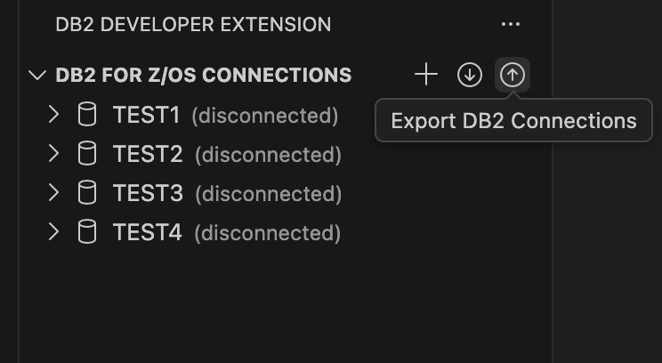
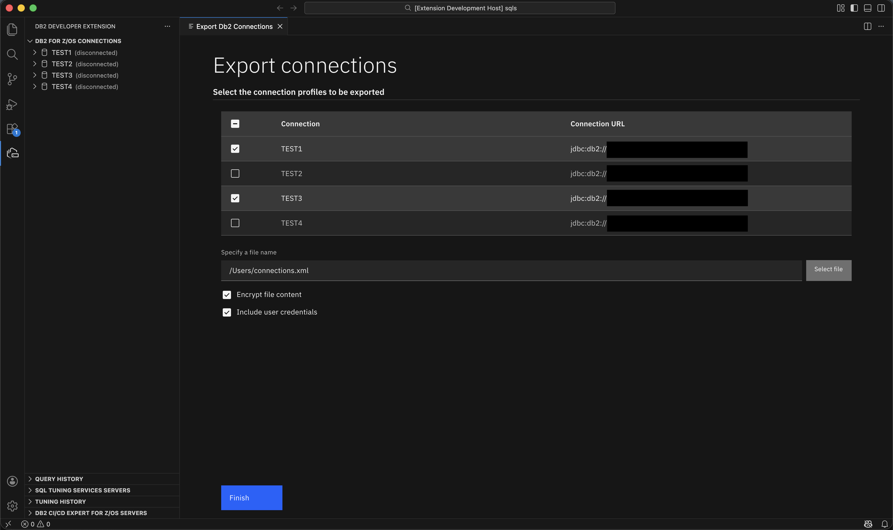

# {{ page.title }}

Exporting your Db2 connections helps you reuse existing connection settings in another VS Code workspace or share them with other users. This avoids manually re-entering host, port, and subsystem information when you set up a new environment. When you export your connections, Db2 Developer Extension saves the connection metadata to an XML file, which you can then import into another installation of the extension.

## Requirements

Before you export your Db2 connections, make sure that:

- You have at least one Db2 connection configured in the **DB2 FOR Z/OS CONNECTIONS** view.
- You have write access to the directory where the exported file will be saved.

## Procedure
To export database connections:

1. From the **DB2 FOR Z/OS CONNECTIONS** view, click **Export Db2 Connections**.
   

2. Select the connections that you want to export.
   

3. Enter a file name and folder for the exported `.xml` file, or click **Select file** to specify a location.

   Optionally, you can configure the following export settings:
   
   - Select **Encrypt file content** if you want the exported file to be encrypted.
   - Select **Include user credentials** if you want to export credentials along with the connection metadata.

4. Click **Finish**.

The connection definitions are saved to the XML file that you specified. You can move this file to another system or share it with other users. To use the exported file in another workspace, import it by using the **Import Db2 connections** command.
